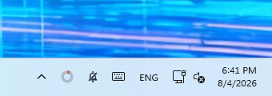
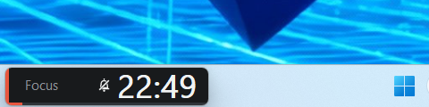
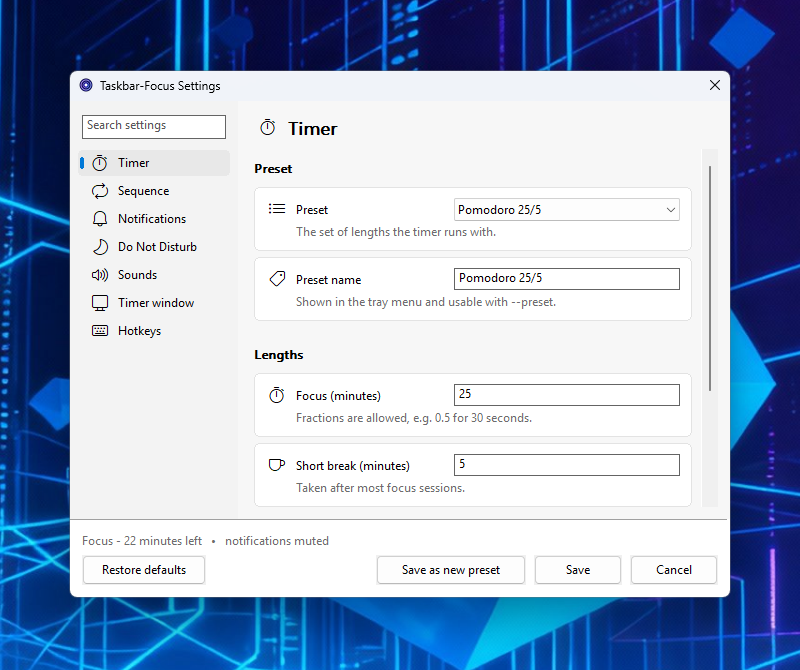

<div align="center">


# Taskbar-Focus

[](https://crates.io/crates/taskbar-focus)
[](https://github.com/yoelrosenthal/taskbar-focus/actions/workflows/ci.yml)
[](LICENSE)
[](https://www.rust-lang.org/)
[](#install)
[](#privacy-and-local-data)

**A lightweight focus timer for Windows with automatic Do Not Disturb.**

Taskbar-Focus keeps the current session visible, silences notifications while
you focus, and restores them when it is time for a break.

Windows 10 or 11 · 64-bit · No administrator access required

</div>

## Install

### Scoop

[Scoop](https://scoop.sh) is the recommended installation method:

```powershell
scoop bucket add taskbar-focus https://github.com/yoelrosenthal/taskbar-focus
scoop install taskbar-focus
```

Update later with `scoop update taskbar-focus`.

### Other options

Download `taskbar-focus.exe` from the
[latest GitHub release](https://github.com/yoelrosenthal/taskbar-focus/releases/latest),
or install it from [crates.io](https://crates.io/crates/taskbar-focus):

```powershell
cargo install taskbar-focus
```

The standalone executable does not require an installer. Place it in any folder
and run it.

## Quick start

1. Open Taskbar-Focus. It runs in the Windows notification area beside the
   clock.
2. Left-click the progress-ring icon to start a focus session.
3. Left-click again to pause or resume. Right-click for breaks, presets,
   settings, and other actions.

Windows 11 may place new notification-area icons behind the **^** arrow. Open
the overflow area and drag the Taskbar-Focus icons onto the taskbar if you want
them to remain visible.

## Tray status

The notification-area icons show the current state without opening a window.



- The **progress ring** is red during focus, green during a break, grey while
  idle, and faded while paused.
- The **crossed-out bell** appears while notifications are muted. It can be
  hidden independently in Settings.

The same muted-notifications indicator can also appear beside the countdown in
the timer window.

## Optional timer window

The timer window is optional and disabled by default. When enabled, it provides
a clear, always-visible countdown that can be moved, resized, and placed over
the taskbar or anywhere else on the desktop. Clicking the window starts,
pauses, or resumes the timer.



Enable it from **Settings → Timer window** or choose **Show timer window** from
the tray menu. Taskbar-Focus remembers its size and position. Use **Reset window
size** to return to the default layout.

## Settings

Double-click the tray icon, or right-click it and choose **Settings...**. The
searchable settings window contains timer lengths, session behavior,
notifications, Do Not Disturb, sounds, timer-window options, and global
hotkeys.



Changes are applied when you select **Save**. Use **Save as new preset** to keep
the current timer lengths as a separate preset.

## Focus sessions and breaks

The default sequence is:

1. Complete a focus session.
2. Start a short break automatically.
3. Start a long break after the configured number of completed focus sessions.
4. Return to idle when the break ends, ready for the next session.

You can change this behavior in Settings. Options include automatically starting
the next focus session, requiring confirmation before stopping strict focus,
and choosing how a running timer handles sleep.

When focus begins, Taskbar-Focus enables the same **Do not disturb** mode used by
Windows. When focus ends, it restores notifications. Windows priority apps and
contacts continue to follow your existing priority settings.

## Presets

Taskbar-Focus includes three presets:

| Preset | Focus | Short break | Long break |
| --- | ---: | ---: | ---: |
| Pomodoro 25/5 | 25 minutes | 5 minutes | 15 minutes |
| Deep Work 90/15 | 90 minutes | 15 minutes | 30 minutes |
| Short 15/3 | 15 minutes | 3 minutes | 10 minutes |

Presets can be edited, duplicated, and selected directly from the tray menu.

## Controls and shortcuts

| Action | Mouse | Default shortcut |
| --- | --- | --- |
| Start, pause, or resume | Left-click the tray icon or timer window | <kbd>Ctrl</kbd>+<kbd>Alt</kbd>+<kbd>F</kbd> |
| Skip to the next interval | Tray menu → **Skip to next** | <kbd>Ctrl</kbd>+<kbd>Alt</kbd>+<kbd>B</kbd> |
| Open Settings | Double-click the tray icon | — |
| Open all actions | Right-click the tray icon or timer window | — |

Global shortcuts work from any application and can be changed or disabled in
Settings.

## Command-line control

Commands are forwarded to the running application, so scripts and shortcuts do
not create a second timer.

```powershell
taskbar-focus --start
taskbar-focus --break
taskbar-focus --toggle
taskbar-focus --skip
taskbar-focus --stop
taskbar-focus --preset "Deep Work 90/15"
taskbar-focus --quit
```

Run `taskbar-focus --help` for the complete command list.

## Privacy and local data

Taskbar-Focus does not require an account, collect telemetry, or make network
connections. It never requires administrator rights.

Local files are stored in `%APPDATA%\taskbar-focus`:

- `config.toml` contains settings and presets in plain text.
- `activity.log` records application activity locally.

## Uninstall

With Scoop:

```powershell
scoop uninstall taskbar-focus
```

With Cargo:

```powershell
cargo uninstall taskbar-focus
```

If you downloaded the executable, delete it. Settings remain in
`%APPDATA%\taskbar-focus` until that folder is removed. Do Not Disturb is
restored when the application exits.

## License

[MIT](LICENSE)
